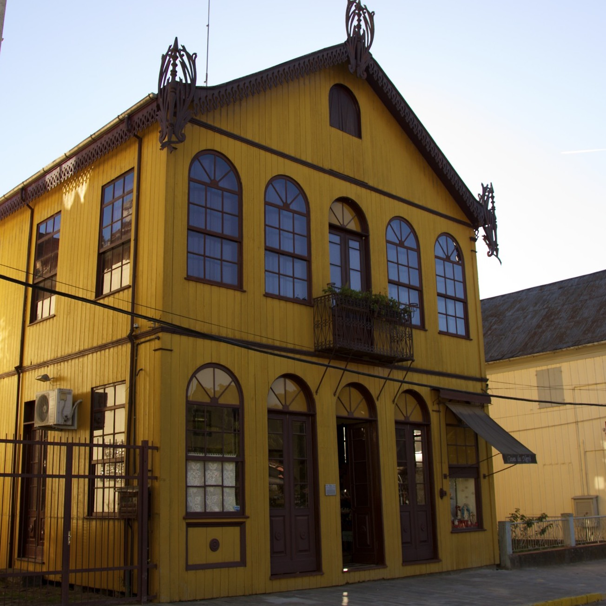

<style>
.image {
  border-radius: 50%;
  <!-- margin: 0.5rem; -->
  min-width: 50%;
  opacity: 1;
  display: block;
  width: 100%;
  height: auto;
  transition: .5s ease;
  backface-visibility: hidden;
}

.curve { 
	width: 35%;
	max-width: 100%;
	height: auto;
	float: right;
	margin: 1.5rem;
	margin-right:1rem;
	shape-outside:circle(50%);
	-webkit-clip-path: circle(50%);
}

<!-- .container { -->
<!--   position: relative; -->
<!--   width: 100%; -->
<!-- } -->

<!-- .middle { -->
<!--   transition: .5s ease; -->
<!--   opacity: 0; -->
<!--   position: absolute; -->
<!--   top: 50%; -->
<!--   left: 50%; -->
<!--   transform: translate(-50%, -50%); -->
<!--   -ms-transform: translate(-50%, -50%) -->
<!-- } -->

<!-- .container:hover .image { -->
<!--   opacity: 0.3; -->
<!-- } -->

<!-- .container:hover .middle { -->
<!--   opacity: 1; -->
<!-- } -->

<!-- .text { -->
<!--   <!-- background-color: white; --> -->
<!--   color: white; -->
<!--   text-color: white; -->
<!--   font-size: 16px; -->
<!--   padding: 6px 6px; -->
<!-- } -->
</style>


<div align = "justify">


`Under construction.` Project by: <a href = "https://nataliaguzzo.github.io" target = "_blank">**Natália B. Guzzo**</a> and <a href="https://guilhermegarcia.github.io" target = "_blank">**Guilherme D. Garcia**</a>

<div class = "curve"></div>In the 19th century, Italian immigrants moved to North and South America. In Brazil, they first immigrated to the southeastern region, and subsequently to the southern region---especially to the southernmost state in the country, <a href = "https://en.wikipedia.org/wiki/Rio_Grande_do_Sul" target = "_blank">Rio Grande do Sul</a>. Many of these immigrants were speakers of <a href = "https://en.wikipedia.org/wiki/Venetian_language" target = "_blank">Veneto</a>, a Romance language spoken in northern Italy. As time went by, a dialect of Veneto, *Brazilian Veneto*, developed in the area(s) where the immigrants settled---we refer to this dialect as *Talian*. In total, there are approximately 500,000 speakers of Talian in Brazil---with varying degrees of proficiency.

We are currently working on a written corpus of Talian, which will be made available here in the near future. Our project focuses on the Talian spoken in the *Italian Immigration Area* (IIA), the area of Rio Grande do Sul where Italian immigrants first settled. The picture shows a historic house in the IIA town of <a href = "https://en.wikipedia.org/wiki/Antônio_Prado" target = "_blank">**Antônio Prado**</a>, where we can find numerous speakers of Talian. 


---


### The Italian Immigration Area in Brazil

The towns and cities in red have Talian as their co-official language, alongside (Brazilian) Portuguese. The gray circle is an approximation representing the Italian Immigration Area in the state of Rio Grande do Sul.

<div align = "center">

```{r, echo = TRUE, fig.align='center', echo = FALSE, message=FALSE, warning=FALSE}
library(leaflet)
library(tidyverse)

# 3, 6 zoom
iia = read_csv("talian/IIA_map.csv")

leaflet(data = iia, width = "80%", height = 600, 
        options = leafletOptions(minZoom = 5, maxZoom = 10, zoomControl = TRUE)) %>% 
    addProviderTiles("OpenStreetMap.Mapnik") %>%
    addCircles(lat = -28.95, lng = -51.54, 
               radius = 55000, color = "Black") %>% 
    setView(zoom = 6, lat = -28.9, lng = -51.542461) %>% 
    addCircleMarkers(lng = iia$long, lat = iia$lat, stroke = F, 
                     radius = log(iia$pop),
                     color = "FireBrick", fillOpacity = 0.5,
                     label = str_c(iia$address, 
                                   " (Pop: ", format(round(as.numeric(iia$pop), 1), 
                                                     nsmall=0, big.mark=","), ")")) 


# leaflet(data = iia, width = "80%", height = 400, 
#         options = leafletOptions(minZoom = 5, maxZoom = 10, zoomControl = FALSE)) %>% 
#     addProviderTiles("OpenStreetMap.Mapnik") %>%
#     addCircleMarkers(lng = iia$long, lat = iia$lat, stroke = TRUE, 
#                      color = "Red", fillOpacity = 0.5, radius = 2,
#                      label = iia$address) %>% 
#     addPolylines(data = iia, lng = ~long, lat = ~lat,
#                 fill = T, fillOpacity = 0.3, weight = 0, 
#                 color = "red", smoothFactor = 1)

```

---

</div>

### Our Talian Corpus

Our corpus consists of internet texts from the IIA as well as excerpts from books written in Talian. Text processing is being done in R [@r_language], and optical character recognition (OCR) is being carried out using Google's <a href = "https://github.com/tesseract-ocr/tesseract/" target = "_blank">**Tesseract**</a> [@tesseract]. As a starting point, we used trained data from Italian in Tesseract, and later checked for potential mismatches. We are currently developing the first version of the corpus, which we plan to make available during the fall of 2020---see below.

#### Stage 1: Fall 2020

- Data collection, OCR, tokenization
    - `21,574 words (in progress)`
    - `1,678 sentences (in progress)`
- Initial coding
- Make initial version available

#### Stage 2: Spring 2021

- Tagging (part of speech)
- Phonetic transcription
- Syllabification

---

### Corpus sample


```{r kable, echo = FALSE, warning=FALSE, message=FALSE}
library(kableExtra)
library(knitr)
require(tidyverse)

load("talian/corpus/talian.RData")

kable(talian %>% slice(1:5) %>% select(sentence, word, frequency, logFrequency, author, year), 
      row.names = FALSE, digits = 3) %>% 
    kable_styling(full_width = F)

```
<br>

As can be seen from the sample above, the corpus follows a `tidy data` approach [@wickham2014tidy]. As a result, little if any data wrangling is needed to analyze the data.


---

### <i class="fas fa-cloud-download-alt"></i>&emsp;Download corpus

To access the corpus, click <a href = "https://guilhermegarcia.github.io/talian_form.html" target ="_blank">**here**</a>

---

### References

<div id="refs"></div>

</div>


---
