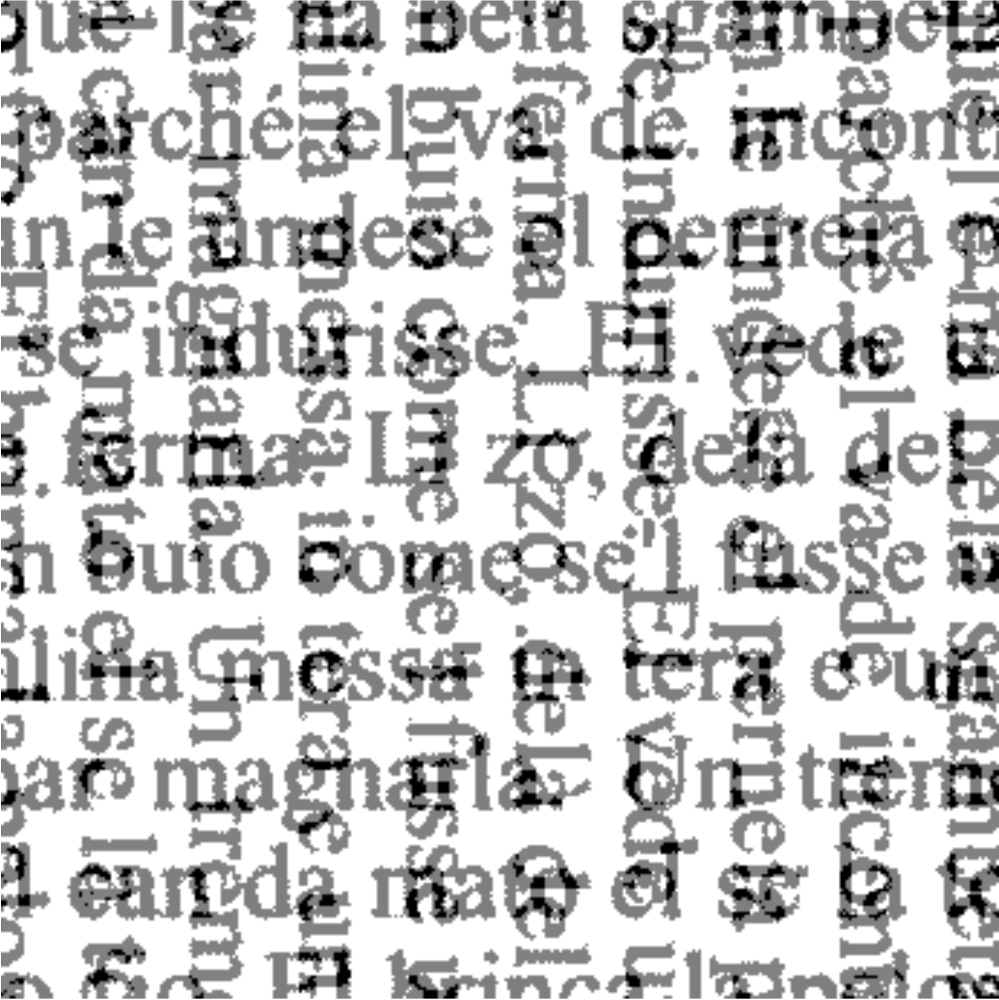

<style>
.image {
  border-radius: 50%;
  <!-- margin: 0.5rem; -->
  min-width: 50%;
  opacity: 1;
  display: block;
  width: 100%;
  height: auto;
  transition: .5s ease;
  backface-visibility: hidden;
}

.curve { 
	width: 35%;
	max-width: 100%;
	height: auto;
	float: right;
	margin: 1.5rem;
	margin-right:1rem;
	shape-outside:circle(50%);
	-webkit-clip-path: circle(50%);
}

<!-- .container { -->
<!--   position: relative; -->
<!--   width: 100%; -->
<!-- } -->

<!-- .middle { -->
<!--   transition: .5s ease; -->
<!--   opacity: 0; -->
<!--   position: absolute; -->
<!--   top: 50%; -->
<!--   left: 50%; -->
<!--   transform: translate(-50%, -50%); -->
<!--   -ms-transform: translate(-50%, -50%) -->
<!-- } -->

<!-- .container:hover .image { -->
<!--   opacity: 0.3; -->
<!-- } -->

<!-- .container:hover .middle { -->
<!--   opacity: 1; -->
<!-- } -->

<!-- .text { -->
<!--   <!-- background-color: white; --> -->
<!--   color: white; -->
<!--   text-color: white; -->
<!--   font-size: 16px; -->
<!--   padding: 6px 6px; -->
<!-- } -->

<!-- @media(prefers-color-scheme: dark){ -->

<!-- img { -->
<!--    -webkit-filter: invert(80%); -->
<!--    filter: invert(80%); -->
<!--    } -->
<!-- } -->

</style>


<div align = "justify">


---

<div align = "center">

<i class="fas fa-home"></i> [**Home**](talian.html) &emsp; <i class="fas fa-comments"></i> [**Language**](talian_language.html) &emsp; <i class="fas fa-folder-open"></i> **Corpus**

</div>

---

<h3>Our Talian Corpus</h3>


```{r echo = FALSE, warning=FALSE, message=FALSE}
library(kableExtra)
library(knitr)
require(tidyverse)

load("talian/corpus/talian.RData")
# Talian = Talian %>% unnest(cols = c(data))

```

<div class = "curve"></div>Our corpus consists of internet texts from the IIA as well as excerpts from books written in Talian. Text processing is being done in R [@r_language], and optical character recognition (OCR) is being carried out using Google's <a href = "https://github.com/tesseract-ocr/tesseract/" target = "_blank">**Tesseract**</a> [@tesseract]. As a starting point, we used trained data from Italian in Tesseract, and later checked for potential mismatches. As of `r format(Sys.Date(), "%B %Y")`, the corpus contains **`r formatC(nrow(Talian), big.mark = ",")`** words and **`r formatC(length(levels(Talian$sentence)), big.mark = ",")`** sentences.


<h4>Stage 1: Fall 2020</h4>

- Data collection, OCR, tokenization
- Initial coding
- Make initial version available

<h4>Stage 2: 2021</h4>

- Data collection, OCR, tokenization
- Phonetic transcription
- Syllabification

<font color = "gray">*Last updated: `r format(Sys.Date(), "%B %d, %Y")`*</font>

---

<h3>What the corpus looks like</h3>

The corpus currently has `r ncol(Talian)` variables/columns. In the table below, you can see a subset of the columns/variables in the corpus.

```{r kable, echo = FALSE, warning=FALSE, message=FALSE}
set.seed(5)
kable(Talian %>% 
          select(sentence, wd, sLength, freq, IPA, nSyl, stress) %>% 
          head(n = 10) %>% droplevels(),
      row.names = FALSE, digits = 3) %>%
    kable_styling(full_width = F) %>% 
    kable_styling(latex_options = "striped") #%>% 
    # row_spec(0:10, color = "white", background = "#414141")
```
<br>

The corpus follows a `tidy data` approach [@wickham2014tidy], so little (if any) data wrangling is needed to analyze the data.


---

<h3><i class="fas fa-cloud-download-alt"></i>&emsp;Download corpus</h3>

To access the corpus, click <a href = "https://osf.io/63nrx/" target = "_blank">**here**</a>. We highly recommend that you load `tidyverse` *before* loading the corpus itself.

---

<h3>Publications</h3>

- Guzzo, N. B. & **G. D. Garcia**. (2020). <a href = "https://guilhermegarcia.github.io/files/guzzo_garcia_jlc_2020.pdf" target = "_blank">Phonological variation and prosodic representation: clitics in Portuguese-Veneto contact</a>. *Journal of Language Contact*, 13(2):389--427.


---

<h3>How to cite the corpus</h3>

**APA:**

Garcia, G. D., & Guzzo, N. B. (2021, April 12). Talian corpus: a written corpus of Brazilian Veneto. `https://doi.org/10.17605/OSF.IO/63NRX`. Available at `https://guilhermegarcia.github.io/talian.html` and `https://nataliaguzzo.github.io/talian.html`.

**BibTeX:**

<pre class='code code-css'><label>TeX</label><code>
@misc{Garcia_Guzzo_2021,
  title={Talian corpus: a written corpus of Brazilian Veneto},
  url={osf.io/63nrx},
  DOI={10.17605/OSF.IO/63NRX},
  publisher={OSF},
  author={Garcia, Guilherme D and Guzzo, Natália B},
  year={2021},
  month={Apr}}
</code></pre>

---

<h3>References</h3>

<div id="refs"></div>

</div>

</div>

---
