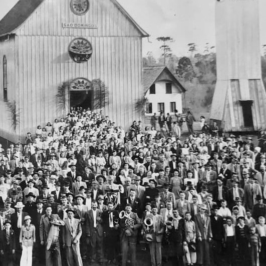

<style>

<!-- .quote { -->
<!--     text-align:center; -->
<!-- } -->

blockquote {
    text-align:center;
    color:#6e6e6e;
    <!-- padding:10px 5px; -->
    <!-- border-left:3px solid #ccc; -->
    display:inline-block;
}

.image {
  border-radius: 50%;
  <!-- margin: 0.5rem; -->
  min-width: 50%;
  opacity: 1;
  display: block;
  width: 100%;
  height: auto;
  transition: .5s ease;
  backface-visibility: hidden;
}

.curve { 
	width: 35%;
	max-width: 100%;
	height: auto;
	float: right;
	margin: 1.5rem;
	margin-right:1rem;
	shape-outside:circle(50%);
	-webkit-clip-path: circle(50%);
}


.column {
  float: left;
  width: 50%;
}

/* Clear floats after the columns */
.row:after {
  content: "";
  display: table;
  clear: both;
}

</style>

---

<div align = "center">

<i class="fas fa-home"></i> [**Home**](talian.html) &emsp; <i class="fas fa-comments"></i> **Language** &emsp; <i class="fas fa-folder"></i> [**Corpus**](talian_corpus.html)

</div>

---

<h3>The language</h3>

<div align = "justify">

<div class = "curve"></div>In total, there are approximately 500,000 speakers of Talian in Brazil, with varying degrees of proficiency. The photo shows Talian speakers in São Domingos (a district of Sananduva, Rio Grande do Sul), circa 1940. 

Talian is a Veneto-based Romance language, and it has some aspects in common with other languages from the same family, such as:

- seven vowels in stressed position (), like Italian and Portuguese;
- a (relatively) rich agreement system;
- (preverbal) object clitics, like Italian, Spanish and French;
- the past tense is formed by auxiliary verb + past participle, like Italian and French.

Talian's lexicon has incorporated several words from Brazilian Portuguese: *zacaré* (from *jacaré* 'alligator'), *sorasco* (from *churrasco* 'barbecue'), *sinela* (from *chinelo* 'sandal').

Because Italian immigrants came from different regions in Italy, very few communities in the IIA spoke a single language or dialect---see table below [@frosi2009, p. 47]. The contact between the various languages spoken by immigrants, the predominance of Veneto dialects among such languages, and the scarce contact with Portuguese favored the development of a Veneto-based dialect in the area.


```{r kable, echo = FALSE, warning=FALSE, message=FALSE}
library(tidyverse)
library(kableExtra)
varieties = read_csv("talian/varieties.csv")

kable(varieties,
      row.names = FALSE) %>%
    kable_styling(full_width = F)

```

---

Below you can listen to the fable *The north wind and the sun*, recorded by a speaker of Talian. 


<div align = "center">

<blockquote>
**El Vento del Norte e el Sol**    

El Vento del Norte e el Sol i zera drio discùter qual zera el pi forte,    
quando un viaiante el ze rivà vestio con na capa grossa.    
I ga dessidio che’l primo que podesse far el viaiante tirar zo la capa    
dovea esser considerà el pi forte de luri due.    
Lora el Vento del Norte el ga sufià el màssimo che’l podea,    
ma de pi che’l sufiea de pi el viaiante se enrolea ntela so capa;    
e par fin el Vento del Norte el ga desistio.    
Lora el Sol el ga slusà ben caldo,    
e el viaiante suito el ga tirà zo la so capa.    
E così el Vento del Norte el ga tocà acetar    
che’l Sol el zera el pi forte de luri due.
</blockquote>    

<audio controls src="talian/audio/fable.wav"></audio>

</div>

---

<h3>References</h3>

<div id="refs"></div>


</div>

---
